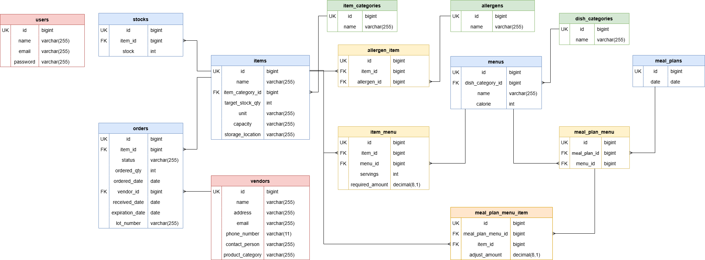

# StockManager 給食・在庫管理アプリ

給食の献立作成及び食材の在庫を管理するためのLaravelプロジェクトです。
行政に提出する栄養報告書を作成するためのcsv出力機能（GASを使用）も備えています。

## 作成者

en6113

## 使用技術

### 🛠️ バックエンド
- PHP 8.2.x
- Laravel 10.x
  - Laravel Fortify (認証機能)

### 💻 フロントエンド
- Blade(テンプレートエンジン)
- Tailwind CSS 3.4
- Vite（ビルドツール）

### 🗄️ データベース
- MySQL 8.4

### 🔌 外部連携
- Google Apps Script

### 🐳 インフラ / 開発環境
- Docker / Docker Compose
- Nginx (Webサーバー)
- phpMyAdmin (データベース管理ツール)

## ER図



## 動作環境

- Docker
- Docker Compose

※ Windowsの場合はWSL2の利用を推奨します。

## 環境構築手順

1. **リポジトリのクローン**

    ```bash
    git clone git@github.com:en6113/stock-manager.git
    ```

2. **.envファイルの準備**

    `.env.example` をコピーして `.env` を作成します。

    ```bash
    cp .env.example .env
    ```

    `.env` ファイル内の以下のDB接続情報が以下と一致していることを確認してください。

    ```ini
    DB_CONNECTION=mysql
    DB_HOST=mysql
    DB_PORT=3306
    DB_DATABASE=laravel
    DB_USERNAME=sail
    DB_PASSWORD=password
    ```

3. **Composer依存パッケージのインストール**

    プロジェクトの初回セットアップ時は、`vendor` ディレクトリが存在しないため `sail` コマンドを使用できません。
    以下のDockerコマンドを実行して、コンテナ内で `composer install` を実行します。

    ```bash
    docker run --rm \
    -u "$(id -u):$(id -g)" \
    -v "$(pwd):/var/www/html" \
    -w /var/www/html \
    -e COMPOSER_CACHE_DIR=/tmp/composer_cache \
    laravelsail/php82-composer:latest \
    composer install
    ```

4. **Laravel Sailの起動**

    以下のコマンドでDockerコンテナを起動します。

    ```bash
    ./vendor/bin/sail up -d
    ```

5. **エイリアスの設定**

    ```bash
    alias sail='[ -f sail ] && bash sail || bash vendor/bin/sail'
    ```

6. **アプリケーションキーの生成**

    ```bash
    sail artisan key:generate
    ```

7. **データベースのマイグレーションと初期データ投入**

    以下のコマンドでテーブルを作成し、ダミーデータを投入します。

    ```bash
    sail artisan migrate:fresh --seed
    ```
    このコマンドの入力後、コンテナ内にデータが残っており、エラーが生じているケースなどがあります。
    その場合は、以下のコマンドを順に実行して各コンテナを再起動して下さい。
    ```bash
    sail down -v
    sail up -d
    sail artisan migrate:fresh --seed
    ```

8. **フロントエンドの準備**

    ```bash
    sail npm install
    sail npm run dev
    ```

    `npm run dev` は開発中は起動したままにしてください。

9. **アプリケーションへのアクセス**

    ブラウザで [http://localhost](http://localhost) にアクセスします。

## 開発環境URL

http://localhost

## 機能一覧

#### アカウント機能
- ユーザー登録 / ログイン / ログアウト(Laravel Fortify)
#### 食材管理機能
- 食材一覧表示(キーワード検索・カテゴリ検索) / 登録/ 編集 / 削除
#### メニュー管理機能
- メニュー一覧表示(キーワード検索・カテゴリ検索) / 登録/ 編集 / 削除
#### 献立管理機能
- 献立一覧表示（月ごとのページネーション） / 登録 / 編集 / 削除
#### 発注・納品履歴管理機能
- 発注・納品情報一覧表示(ステータス検索・発注業者検索) / 登録 / 編集 / 削除
#### 在庫管理機能
- 在庫一覧表示 / 更新
#### CSV出力機能
- 行政に提出する栄養報告書作成用に指定期間の献立に含まれる栄養素をCSV出力
